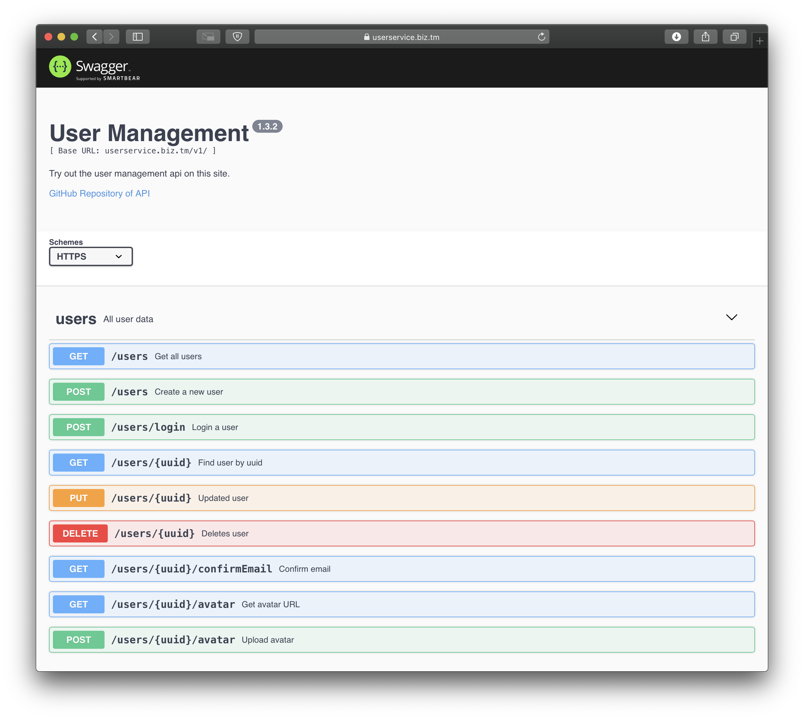

# UserManagement-API
 Very basic API build using node.js and Express connected to a MySQL database.

## Dependencies
- node.js
- npm

## Setting up the API
1. Clone this repository with `git clone https://github.com/strumswell/UserManagement-API.git`
2. Install node packages with `npm install`
3. Create .env with the following content:
```
NODE_ENV=development
SQL_HOST=''
SQL_USER=''
SQL_PASSWORD=''
SQL_DATABASE=''
```
4. Execute the app with `node app.js`


